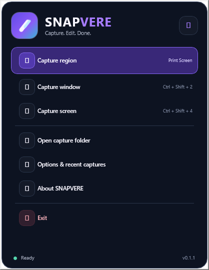
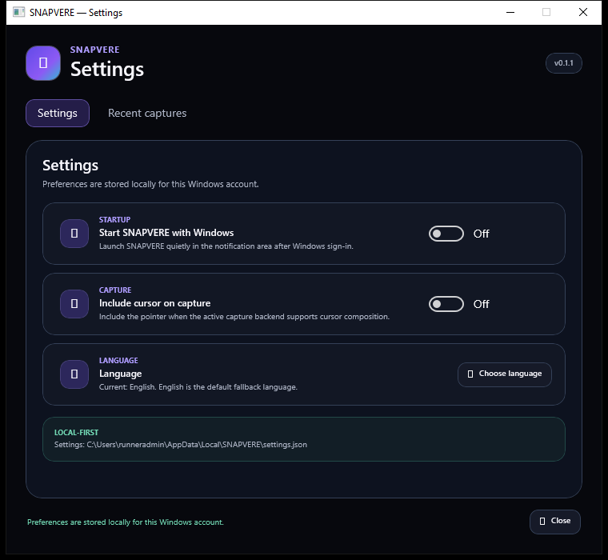
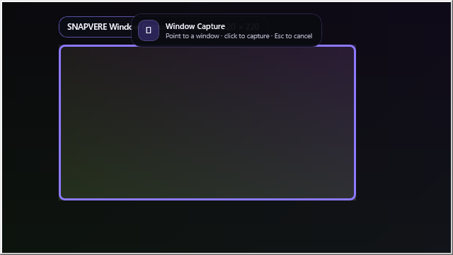

<picture>
  <source media="(prefers-color-scheme: dark)" srcset="assets/branding/readme/snapvere-logo-dark.svg">
  <source media="(prefers-color-scheme: light)" srcset="assets/branding/readme/snapvere-logo-light.svg">
  
</picture>

### Snimi. Uredi. Gotovo.

**Brz, lokalno usmjeren alat za snimke zaslona na Windowsu i modernim preglednicima.**  
Bez računa. Bez telemetrije snimki. Bez automatskog cloud uploada.

[Web stranica](https://snapvere.com) · [Preuzmi v0.1.4](https://github.com/bren-wp/SNAPVERE/releases/tag/v0.1.4) · [Dokumentacija](docs/hr/README.md) · [English](README.md)

---

## Zašto SNAPVERE

SNAPVERE 0.1.4 namijenjen je korisnicima koji žele brz i čist screenshot workflow: snimiti točne piksele, označiti ih, kopirati ili spremiti lokalno i nastaviti raditi.

| | Što dobivate |
| --- | --- |
| ⚡ **Brzo snimanje** | Region, window i screen capture na Windowsu te visible-area, region i ograničeni full-page capture u preglednicima. |
| ✏️ **Ugrađene anotacije** | Pen, Line, Arrow, Box i Highlight izravno u Windows region workflowu. |
| 🖥️ **Nativni Windows workflow** | Tray-first rad, globalni prečaci, nedavne snimke, lokalne postavke i DPI-aware multi-monitor podrška. |
| 🔒 **Local-first pristup** | Osnovna obrada snimki ostaje lokalna; račun nije potreban i capture runtime nema first-party telemetriju snimki. |
| 📦 **Setup ili Portable** | Universal Windows paketi s x86, x64 i ARM64 aplikacijskim payloadima. |
| 🌐 **Četiri preglednika** | Chrome, Edge, Opera i Firefox dijele isti zaključani SNAPVERE brand i ograničeno capture ponašanje. |

Verzija 0.1.4 dodatno čisti korisničko Windows iskustvo: interni detalji iznimki ostaju u ograničenom lokalnom diagnostic logu umjesto u Settings, Language, About, Setup ili Region Capture sučelju; oznake prečaca u trayu odgovaraju stvarno registriranim tipkama; a nepromijenjene postavke više se nepotrebno ne zapisuju na disk.

## Windows workflow

SNAPVERE radi prvenstveno iz područja obavijesti, bez stalno otvorenog dashboarda.

| Radnja | Prečac | Rezultat |
| --- | --- | --- |
| **Region Capture** | `Print Screen` ili `Ctrl+Shift+1` | Zamrzni prikaz, odaberi regiju, promijeni veličinu, označi, kopiraj ili spremi. |
| **Window Capture** | `Ctrl+Shift+2` | Odaberi vidljivi prozor sa zamrznutog prikaza i snimi ga. |
| **Screen Capture** | `Ctrl+Shift+3` | Brzo pokreni snimanje zaslona. |

Snimke se zadano spremaju u `Pictures\SNAPVERE`. PNG zapis koristi staging prije završnog premještanja kako prekinuti encode ne bi izgledao kao gotova snimka.

## Multi-monitor i memorija

SNAPVERE koristi nativnu geometriju zaslona i DPI pretvorbu umjesto pretpostavke da svi monitori imaju isti scaling. Aktualni memory hardening uklanja redundantne full-frame staging alokacije iz Region i Window Capture putova te ranije oslobađa zamrznute monitor buffere čim je UI bitmap spreman.

Detalji su u [Performanse i stabilnost](docs/hr/PERFORMANCE.md), [Window Capture](docs/hr/WINDOW-CAPTURE.md) i [Multi-monitor dokumentaciji](docs/MULTI-MONITOR.md).

## Browser ekstenzije

Chrome, Edge, Opera i Firefox nude visible-area, selected-region i bounded full-page capture, lokalno PNG spremanje te EN/HR sučelje. Naziv proizvoda, wordmark i prefiks spremljene datoteke ostaju fiksno **SNAPVERE**.

Dozvole su točno `activeTab`, `scripting`, `downloads` i `storage`, bez širokog host pristupa. Full-page capture koristi ograničeni destination canvas i oslobađa dekodirane tile resurse odmah nakon crtanja.

Browser ZIP paketi namijenjeni su ručnoj instalaciji. Vanjsko store odobrenje ne tvrdi se dok stvarni listing nije objavljen.

## SNAPVERE u stvarnom radu

Ovo su **stvarne renderirane Windows površine koje je snimio SNAPVERE visual-QA pipeline** iz istog validiranog koda — nisu dizajnerski mockupovi.

<table>
<tr>
<td width="38%" valign="top"> <strong>Tray-first workflow</strong> Region, window i screen capture bez stalno otvorenog dashboarda.</td>
<td width="62%" valign="top"> <strong>Lokalne postavke</strong> Startup, cursor i jezične postavke ostaju fokusirane i lokalne za Windows račun.</td>
</tr>
</table>

**Window Capture** — zamrznuta površina za jasan odabir ciljnog prozora prije snimanja.

## Preuzimanja

Aktualno izdanje: **SNAPVERE 0.1.4** 
Izdanje: https://github.com/bren-wp/SNAPVERE/releases/tag/v0.1.4

| Platforma | Paket |
| --- | --- |
| Windows Setup | `SNAPVERE-Setup.exe` |
| Windows Portable | `SNAPVERE-Portable.exe` |
| Chrome | `SNAPVERE-Chrome.zip` |
| Edge | `SNAPVERE-Edge.zip` |
| Opera | `SNAPVERE-Opera.zip` |
| Firefox | `SNAPVERE-Firefox.zip` |

Aktualni ugovor proizvoda sadrži ovih šest održavanih paketa.

## Kvaliteta koju možete provjeriti

CI ne provjerava samo kompilaciju. Trenutno obuhvaća x64 build i unit testove, x86 i ARM64 buildove, stvarne renderirane WinUI snapshotove, usporedbu s `main` baselineom, universal Setup/Portable pakiranje, package-size budget, x64/x86 lifecycle provjeru, browser runtime i permission validaciju, brand lock, EN/HR paritet, reproducibilno pakiranje, Product Contract CI i CodeQL.

Ti gateovi smanjuju rizik regresija; nisu tvrdnja da Windows, driver ili preglednik nikada ne može pogriješiti.

## Privatnost i sigurnost

Osnovna obrada snimki je lokalna. SNAPVERE ne zahtijeva korisnički račun za capture, capture runtime nema first-party screenshot analitiku i snimke se ne šalju automatski u cloud.

Pročitajte [Privatnost](docs/hr/PRIVACY.md), [Security Policy](SECURITY.md), [Status proizvoda](docs/hr/PRODUCT-STATUS.md) i [QA matricu](docs/hr/QA-MATRIX.md).

## Dokumentacija

- [Korisnički vodič](docs/hr/USER-GUIDE.md)
- [Instalacija](docs/hr/INSTALLATION.md)
- [Performanse i stabilnost](docs/hr/PERFORMANCE.md)
- [Window Capture](docs/hr/WINDOW-CAPTURE.md)
- [Image Pipeline](docs/hr/IMAGE-PIPELINE.md)
- [Tray i lifecycle](docs/hr/TRAY-LIFECYCLE.md)
- [Browser ekstenzije](docs/hr/BROWSER-EXTENSIONS.md)
- [Postavke](docs/hr/SETTINGS.md)
- [Rješavanje problema](docs/hr/TROUBLESHOOTING.md)
- [Status proizvoda](docs/hr/PRODUCT-STATUS.md)
- [QA matrica](docs/hr/QA-MATRIX.md)
- [Branding](docs/BRANDING.md)

## Brand i izdavač

**SNAPVERE** je brand proizvoda. **Brendigo** je developer i izdavač.

Službena stranica: https://snapvere.com  
Podrška: info@snapvere.com  
Izdavač: https://brendigo.com

Povijesne činjenice o izdanjima ostaju u [RELEASES.md](RELEASES.md); aktualna dokumentacija opisuje održavani Windows/browser proizvod.
