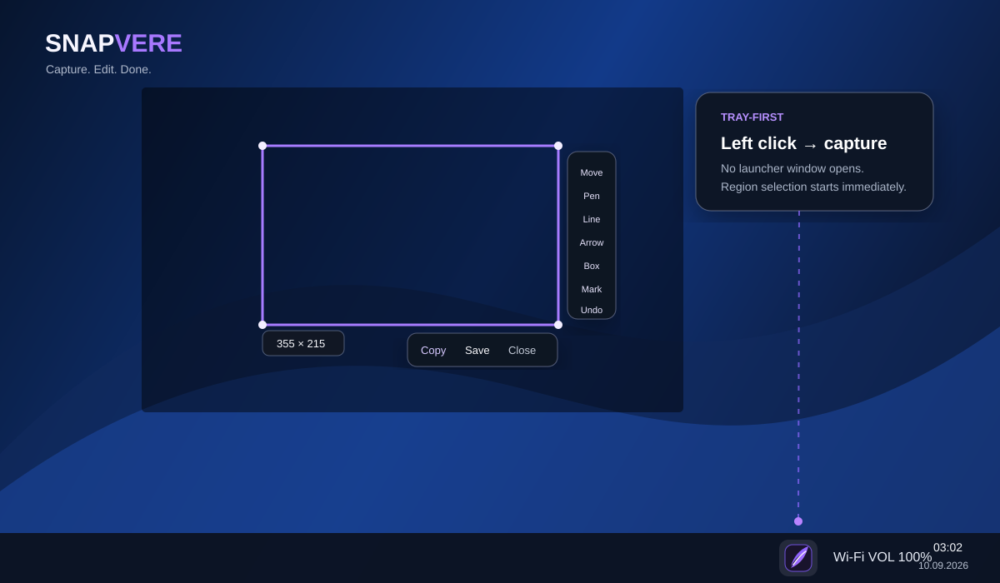
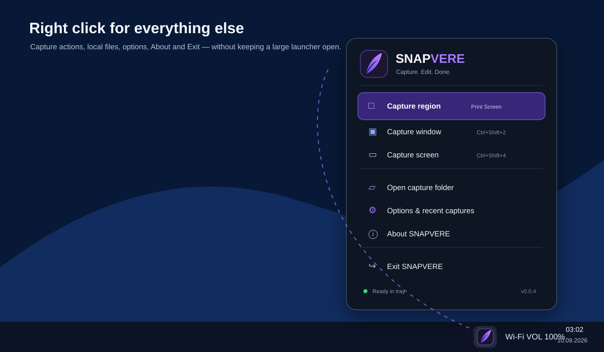
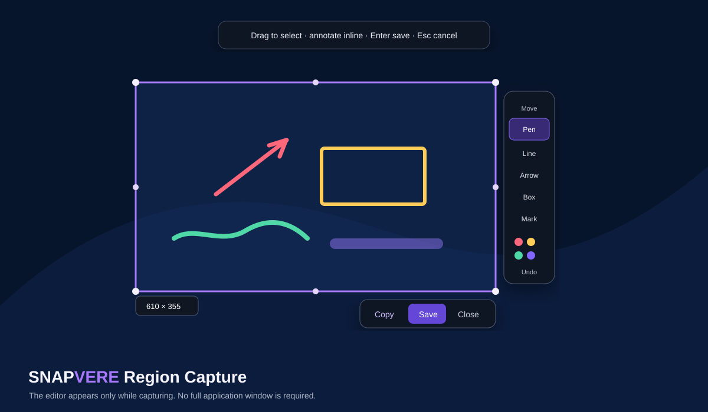

# SNAPVERE

<picture>
  <source media="(prefers-color-scheme: dark)" srcset="assets/branding/readme/snapvere-logo-dark.svg">
  <source media="(prefers-color-scheme: light)" srcset="assets/branding/readme/snapvere-logo-light.svg">
  
</picture>

**Capture. Edit. Done. — fast, local-first screen capture for Windows by Brendigo.**

SNAPVERE is designed to stay out of the way. Start it once and it lives in the Windows notification area instead of keeping a launcher window open.

> Current `main` targets **0.0.4**. The release is not considered published until GitHub Actions completes the release workflow and creates the immutable `v0.0.4` release assets.

## How SNAPVERE works

1. SNAPVERE starts silently in the tray.
2. Left-click the tray icon or press Print Screen.
3. Drag a Region selection on the frozen screen.
4. Annotate directly over the selection when needed.
5. Copy to the clipboard or save a local PNG.

### Left-click tray → Region Capture

**Left-click the SNAPVERE tray icon and Region Capture starts immediately.** No dashboard or intermediate menu is opened.



### Right-click tray → quick actions

**Right-click the tray icon to open the branded SNAPVERE flyout.**

The implemented menu exposes:

- Capture Region
- Capture Window
- Capture Screen
- Open Capture Folder
- Recent captures
- Options / Preferences
- About SNAPVERE
- Exit SNAPVERE



### Region editor

The editor exists only while Region Capture is active. Selection, annotation, Copy and Save happen directly over the frozen screen.



> The SVGs above are repository-maintained **workflow illustrations** of implemented product behavior. They are not presented as pixel-identical Windows screenshots. Real product screenshots will only be committed when they can be reproducibly captured from the actual application and kept synchronized with the release UI.

## Capture controls

| Action | Primary input | Fallback / alternate |
| --- | --- | --- |
| Region Capture | **Left-click tray icon** or **Print Screen** | `Ctrl+Shift+1` |
| Window Capture | Right-click tray → Capture Window | `Ctrl+Shift+2` |
| Screen Capture | Right-click tray → Capture Screen | `Ctrl+Shift+4` |
| Tray quick actions | **Right-click tray icon** | — |
| Recent captures | Right-click tray → Recent captures | — |
| Options / Preferences | Right-click tray → Options / Preferences | — |
| About | Right-click tray → About SNAPVERE | — |
| Exit | Right-click tray → Exit SNAPVERE | — |

If Windows or another application owns Print Screen, the independent `Ctrl+Shift+1` shortcut keeps Region Capture available.

## What's in the 0.0.4 line

The current development line builds on v0.0.3 with a tray-first product architecture:

- normal startup stays hidden in the notification area;
- tray single left-click starts Region Capture immediately;
- right-click opens a branded programmatic WinUI quick-action flyout;
- Print Screen maps to Region Capture with `Ctrl+Shift+1` fallback;
- separate real Options / Preferences and Recent Captures surfaces replace the old visible capture dashboard path;
- implemented preferences include **Start SNAPVERE with Windows** and **Include cursor on capture**;
- installed and Portable startup registration resolves to stable executables rather than temporary cache paths;
- refreshed violet SNAPVERE shard/feather identity for tray and repository surfaces;
- explicit tray-only startup probes validate installed and Portable packages;
- strict x64/x86 package lifecycle verifies Setup, Portable and same-Setup uninstall behavior.

## Region Capture

Implemented today:

- frozen primary-display preview;
- physical-pixel drag selection with reverse-drag normalization;
- drag-to-move and eight resize handles;
- live `W × H` physical-pixel badge;
- Arrow 1 px / Shift+Arrow 10 px movement;
- Move, Pen, Line, Arrow, Box and Highlight tools;
- annotation colors and Undo;
- `Ctrl+Z` Undo and `Ctrl+C` Copy;
- Copy to Windows clipboard;
- Save to local PNG;
- Enter/double-click save and Esc cancel;
- annotations rendered into final output rather than existing only as UI overlay;
- final crop produced from the same frozen frame shown by the editor.

Text, blur/pixelate, ellipse and numbered-step tools remain deliberately absent until production-implemented.

## Window Capture

Implemented today:

- visible top-level window discovery;
- DWM extended-frame bounds;
- SNAPVERE/self/tool/cloaked/invisible-window filtering;
- native Z-order snapshot **before** picker overlays appear;
- overlay-safe geometric hit testing;
- one frozen DPI-aware picker surface per monitor;
- negative virtual-desktop coordinate support;
- coordinated highlight for windows spanning monitors;
- hover title and physical-size feedback;
- left-click capture / Esc cancel;
- Windows.Graphics.Capture `CreateForWindow` acquisition;
- atomic local PNG save and Recent Captures integration.

Window Capture requires the WGC path used by SNAPVERE on Windows 10 version 2004 / build 19041 or later. It does not silently degrade to a screen crop.

## Screen Capture

Current Screen Capture is intentionally simple and fast:

- primary-display capture;
- Windows.Graphics.Capture + Direct3D 11 preferred acquisition on Windows 10 build 19041+;
- GDI monitor compatibility fallback for expected WGC/platform/native acquisition failures;
- caller cancellation never becomes hidden fallback work;
- optional cursor through the real local preference;
- atomic local PNG persistence.

Monitor-under-cursor and all-monitors product options are not shown until implemented and release-tested.

## Options / Preferences

Right-click tray → **Options / Preferences** opens a secondary settings surface; it does not reintroduce the Capture Center.

Implemented preferences:

- **Start SNAPVERE with Windows** — current-user Windows startup registration;
- **Include cursor on capture** — applied by Region, Window and Screen workflows where the backend supports it.

Capture preferences are stored locally at:

```text
%LOCALAPPDATA%\SNAPVERE\settings.json
```

Recent Captures is available as a separate section with real local refresh/open/folder actions.

See [`docs/SETTINGS.md`](docs/SETTINGS.md).

## Architecture

```text
Tray left-click / Print Screen / capture hotkeys / branded tray menu
    ↓
Snapvere.Application workflows
    ├── Region / Screen → ResilientScreenCaptureService
    │                    ├── preferred: WindowsGraphicsCaptureService
    │                    └── fallback: GdiScreenCaptureService
    │
    └── Window → WindowTargetPicker
                 └── WindowsGraphicsCaptureService.CreateForWindow
    ↓
CaptureFrame (physical BGRA8 pixels)
    ↓
Snapvere.Imaging crop / annotation render / PNG encode
    ↓
CaptureFileWriter or Windows Clipboard
    ↓
Pictures\SNAPVERE / clipboard
```

WGC/D3D capture resources are lazy and are not initialized just to keep SNAPVERE resident in the tray.

Read more:

- [`docs/ARCHITECTURE.md`](docs/ARCHITECTURE.md)
- [`docs/TRAY-UX.md`](docs/TRAY-UX.md)
- [`docs/CAPTURE-ENGINE.md`](docs/CAPTURE-ENGINE.md)
- [`docs/REGION-CAPTURE.md`](docs/REGION-CAPTURE.md)
- [`docs/WINDOW-CAPTURE.md`](docs/WINDOW-CAPTURE.md)
- [`docs/MULTI-MONITOR.md`](docs/MULTI-MONITOR.md)
- [`docs/SETTINGS.md`](docs/SETTINGS.md)
- [`docs/INSTALLATION.md`](docs/INSTALLATION.md)
- [`docs/BRANDING.md`](docs/BRANDING.md)

## Packaging

Public 0.0.4 release builds are native self-contained x64 and x86/32-bit packages.

The release workflow is expected to publish exactly:

- `SNAPVERE-0.0.4-Setup-x64.exe`
- `SNAPVERE-0.0.4-Portable-x64.exe`
- `SNAPVERE-0.0.4-Setup-x86.exe`
- `SNAPVERE-0.0.4-Portable-x86.exe`
- `SNAPVERE-0.0.4-x64.zip`
- `SNAPVERE-0.0.4-x86.zip`
- `SHA256SUMS.txt`

### Same-Setup uninstall contract

SNAPVERE intentionally does **not** install a separate `uninstall.exe`, `uninstaller.exe`, `unins000.exe` or Inno-style `unins*.exe`.

Windows Installed apps points back to:

```text
SNAPVERE-Setup.exe --uninstall
```

The same Setup binary owns install/maintenance/removal. Setup validates the SNAPVERE installation marker before recursive deletion.

If **Start SNAPVERE with Windows** was enabled for an installed build, uninstall removes the startup value only when it points exactly to that validated installed `Snapvere.exe`. A different Portable registration is preserved.

Screenshots under `Pictures\SNAPVERE` are preserved when the application is uninstalled.

## Automated QA

GitHub Actions validates x64 and x86 on `windows-2022`. The package lifecycle gate checks:

- strict restore/build + unit tests;
- self-contained application publish;
- Setup and Portable EXE generation;
- explicit license acceptance for silent Setup;
- Installed apps uninstall registration;
- no standalone uninstaller payload;
- separate activated-window construction probe;
- **tray-only startup probe with the Capture Center hidden**;
- Region-editor runtime materialization;
- Window-picker runtime materialization;
- normal installed and Portable tray-first process survival;
- installed Windows startup registration cleanup on uninstall;
- same-Setup uninstall cleanup.

Hosted CI is not treated as proof of capturing arbitrary protected end-user desktop content. WGC/native capture is production-wired while package/runtime surfaces are validated independently.

## Platform and technology

- C# / .NET 10
- WinUI 3 / Windows App SDK 1.8 stable line
- Windows.Graphics.Capture + Direct3D 11
- native Win32 / DWM / GDI interoperability
- Windows 10 version 1809 / build 17763 minimum application target
- WGC monitor and Window Capture paths used from Windows 10 version 2004 / build 19041
- x64 and x86 public packages; ARM64 remains a source/build target
- strict nullable/analyzer settings and deterministic builds
- central NuGet management
- xUnit tests
- GitHub Actions CI + release automation

## Privacy

SNAPVERE is local-first. Current capture workflows do not upload screenshot pixels, recent-capture history or user files to analytics or telemetry services. Core capture has no account or cloud dependency.

Files are saved locally unless the user explicitly copies or shares them elsewhere.

## Current limitations

Intentionally deferred rather than exposed as fake UI:

- coordinated cross-monitor Region freeze composition;
- monitor-under-cursor/all-monitors Screen Capture UI;
- scrolling capture;
- text, ellipse, blur/pixelate and numbered-step annotations;
- expanded History management, favorites and Pin to Screen;
- OCR;
- automatic updater;
- Authenticode signing.

## Build

```powershell
dotnet restore SNAPVERE.sln
dotnet build SNAPVERE.sln -c Release -p:Platform=x64
dotnet test tests/Snapvere.UnitTests/Snapvere.UnitTests.csproj -c Release -p:Platform=x64
```

32-bit app build:

```powershell
dotnet restore src/Snapvere.App/Snapvere.App.csproj -r win-x86
dotnet build src/Snapvere.App/Snapvere.App.csproj -c Release -r win-x86 -p:Platform=x86
```

## Diagnostics

Startup diagnostics remain local at:

```text
%LOCALAPPDATA%\SNAPVERE\Logs\startup.log
```

Capture pixels are not written to the startup log.

## Branding

Canonical vector identity lives under `assets/branding/`. Repository workflow illustrations live under `docs/images/`. See [`docs/BRANDING.md`](docs/BRANDING.md).

## License

Source code is distributed under the Mozilla Public License 2.0. Product branding and trademarks are not granted by the source-code license.

---

**SNAPVERE — Capture. Edit. Done.**  
Developed and published by **Brendigo**.
